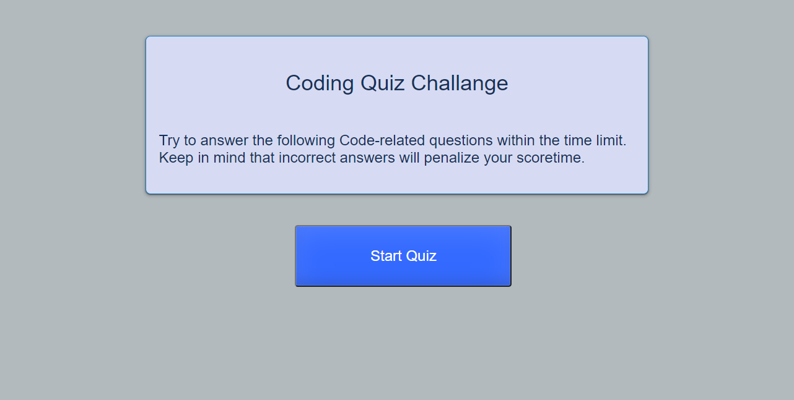

## Web APIs: Code Quiz

---

## Deployed app https://zoneam.github.io/javascript-quiz/

## Acceptance Criteria for Web APIs Code Quiz

```
GIVEN I am taking a code quiz
WHEN I click the start button
THEN a timer starts and I am presented with a question
WHEN I answer a question
THEN I am presented with another question
WHEN I answer a question incorrectly
THEN time is subtracted from the clock
WHEN all questions are answered or the timer reaches 0
THEN the game is over
WHEN the game is over
THEN I can save my initials and my score
```

#### html

     [x] Created html file
     [x] Created title tag, paragraphs added buttons and assignef start function to start button
     [x] Created question card, created form within the card
     [x] Created Ordered list dummy tags so we can add questions and high scorer to our lists
     [x] Assigned id's and classes to our elements
     [x] Linked CSS and JS files

---

#### CSS

     [x] Added styling to our body element
     [x] Added styling to our buttons
     [x] Added hover on our li button and highscores elements
     [x] Added styling to all other elements

---

#### JavaScript

     [x] Added all variables we will need
     [x] Grabbed our classes and Id's and assigned to apropriate variables
     [x] when initializing page parsing Highscores from local memory, if not available assigning empty array
     [x] Declared our questions and answers in array of objects
     [x] Function start() starts timer myTimer() and creates createQuestions() our list elements
     [x] Also adds click event listener to see if user clicks on one of the answers
     [x] Compares clicked answer to our predefined answers and displays if it is correct or incorrect
     [x] If user answers incorrect than it deducts from remaining time 10 seconds
     [x] If it reaches end of questions we are calling endQuiz() function which removes all answers from screen and clears interval of our timer
     [x] When we reach end question prompt comes up asking to enter name
     [x] When user enters name and submits our displayHighscores() function kicks off and it displays sorted highscores also it adds our score to local memory
     [x] We calculate score based on how quickly user answers questions and how many questions are correctly answered
     [x] When user clicks show Highscores everything stops and highscores are displayed
     [x] User can click on try again button and start quiz again


